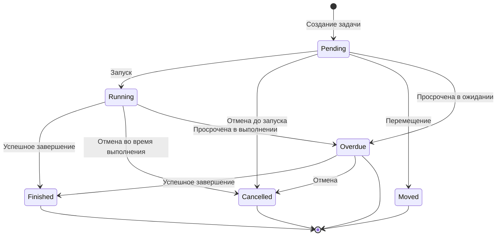

# Тестовое задание для medods
По заданию необходимо было разработать API для системы менеджмента задач для сотрудников медицинской организации.

Система реализовывалась на **golang** с фреймворком **gin**. Тестировалась с помощью **e2e** тестирования с использованием **testify**. Данные хранятся в **postgres**.

В рамках тестового задания были разработаны:
- (OpenApi спецификация)[openapi.yml], которую можно посмотреть используя онлайн (редактор)[https://editor.swagger.io/];
- Приложение, реализующее эту спецификацию;
- Набор e2e тестов для приложения;
- Документация по сборке и использованию.

Из ИИ-инструментов использовались:
- Claude Sonnet 5 (браузерная версия) - (чат)[https://claude.ai/share/fef6a4b6-503c-49c8-a528-63d2e65137ae]
- Deepseek (браузерный) - (чат)[https://chat.deepseek.com/share/fe00oqenkexoy1yrk3]

## Архитектурные решения
1. разделение на шаблоны\задачи - задачи создаются автоматически системой из шаблона. Шаблон объединяет в одну сущность общую для всех задач информацию (название, описание, время) и информацию, необходимую для планирования.
2. использование готовых планировщиков, вместо реализации своих - для создания ежедневных\недельных\месячных задач используется внешняя служба (cron), которая хукает специальный эндпоинт раз в день\неделю\месяц. Этот специальный эндпоинт создаёт и сохраняет соответствующие задачи из шаблонов, которые он берёт из БД. Такой подход позволяет не изобретать велосипед? повышает надёжность за счёт использования проверенного временем решения (cron), значительно упрощает масштабирование и синхронизацию ценой дополнительной инфраструктурной работы.
3. неизменяемость - шаблоны, задачи и теги неизменяемы т.к. их изменение сделает неактуальными уже созданные на их основе задачи и нарушает исторические данные. Вместо редактирования ресурса, старый ресурс помечается как удалённый и замещается новым. Таким образом, исторические данные сохраняются, но процесс редактирования усложняется.

Какие возможные бизнес сценарии были учтены?
- возможность исключить конкретные дни из планирования (к примеру в случае выходных или иных причин) для ежедневных задач. Можно исключить по точному совпадению даты, либо по паттерну.
- возможность указать время начала и конца выполнения для каждой индивидуальной задачи.
- возможность переноса конкретной задачи на другую дату\время.
- возможность включить\отключить атоматическое назначение задач.
- возможность многочисленного переноса задачи.

## Сборка и запуск
Собрать проект можно двумя способами:
1. вручную;
2. с помощью предварительно заготовленного скрипта `make`.

### Докер
Конфигурации для докера хранятся в `deploy`, для запуска необходим установленный докер.
```bash
# Если нужно запустить приложение
cp deploy/prod/* .
# Если нужно запустить тесты
# cp deploy/test/* .

docker compose up
```

Также можно запустить с помощью `make`.
```bash
make run-docker
```

### Бинарник
Чтобы запустить вручную нужно уже иметь предустановленный компилятор `go` и ввести следующие команды в корне проекта:
```bash
go mod download

go build -o trackmytasks ./cmd/track-my-tasks

# Сначала миграции, потом сиды, потом запускаем само приложение. Перед этим необходимо развернуть рабочий инстанс постгреса.
MIGRATIONS_PATH=./migrations/postgres SEEDS_PATH=./seeds/postgres DB_NAME=<имя бд> DB_HOST=<ip-адрес> DB_USER=<пользователь> DB_PASSWORD=<пароль> ./track-my-tasks migrate
MIGRATIONS_PATH=./migrations/postgres SEEDS_PATH=./seeds/postgres DB_NAME=<имя бд> DB_HOST=<ip-адрес> DB_USER=<пользователь> DB_PASSWORD=<пароль> ./track-my-tasks seed
MIGRATIONS_PATH=./migrations/postgres SEEDS_PATH=./seeds/postgres DB_NAME=<имя бд> DB_HOST=<ip-адрес> DB_USER=<пользователь> DB_PASSWORD=<пароль> ./track-my-tasks serve
```

Чтобы запустить с помощью `make` нужно ввести следующие команды:
```bash
make run-binary
```

Переопределить параметры можно с помощью ручного указания переменных окружения:
```bash
GO_COMPILER=/opt/go/bin/go make run-binary
```

Посмотреть переменные окружения можно с помощью `make help` или напрямую в `makefile`:
```bash
make help

Make scripts for track-my-tasks app:

  all                     tests, build and code-quality checks (default)
  all-tests               build the e2e binary and run unit tests
  all-build               build the app binary, compose files and docker image
  all-code                run static checks and format code

  run-binary              build the app and run migrate -> seed -> serve
  run-compose             alias of run-docker
  run-docker              copy deploy/prod files to root and docker compose up

  run-tests-unit          run unit tests
  run-tests-e2e           build and run the e2e test binary
  run-tests-e2e-compose   copy deploy/test files to root and docker compose up

  code-inspect            run static analysis (go vet)
  code-style              format the codebase (go fmt)

  clean                   remove build artifacts and copied deploy files

Configuration (override with VAR=value, e.g. make all GO_COMPILER=go1.22):
  GO_COMPILER             go binary to build/test with (default: go)
  GO_LINTER               go binary used by code-style (default: go)
  GO_STATIC_ANALYZER      go binary used by code-inspect (default: go)
  DOCKER_BIN              docker binary/path (default: docker)
  APP_NAME                binary/image name (default: track-my-tasks)
  APP_VERSION             build/image version (default: v0.0.0)
  APP_RELEASE             prod or test - picks deploy/ config for application-compose (default: prod)
  APP_ROOT                project root, rarely needs changing (default: .)
```

## Структура проекта
```
.
├── build
│   └── v0.0.0
├── cmd
│   └── track-my-tasks
├── deploy
│   ├── prod            # Конфигурация докера для прода
│   └── test            # Конфигурация докера для тестов
├── internal
│   ├── app
│   │   └── config      # Конфигурация и обработка консольного ввода
│   ├── domain
│   │   ├── models      # Общие структуры
│   │   └── scheduling  # Планирование задач
│   ├── repository      # Работа с БД
│   └── transport
│       └── http
│           └── handler # HTTP обработчики
├── migrations
│   └── postgres        # Схема БД
├── seeds
│   └── postgres        # Предопределённые данные
└── tests
    └── e2e             # E2E тесты
```

## Что можно улучшить
1. Сделать возможность делать цепочки зависимых задач (к примеру, обход нельзя начать пока не выполнен "подготовить инструменты") которые могут быть обязательными или опциональными для следующей.
2. Структурное разделение на филиалы, где у каждого филиала своя таймзона по которой расчитываются задачи.
3. Сделать возможность переноса задачи множество раз с сохранением истории переносов.
4. Сделать поддержку начала недели с воскресенья (как это принято в США), а не только с понедельника.
5. Сделать возможность указывать крайний срок выполнения задачи, после которого будет выполняться какое-то действие (уведомить кого-то, пометить как "просрочено", заблокировать выполнение другой задачи и т.д.).
6. Сделать возможность выбрать действие в случае если задача назначена на несуществующую дату (например 29-31 февраля). Чтобы можно было отменить задачу, перенести на ближайший день следующего месяца, либо на последний день текущего месяца.

## Детали


## Лицензия
[AGPL-3.0](LICENSE)